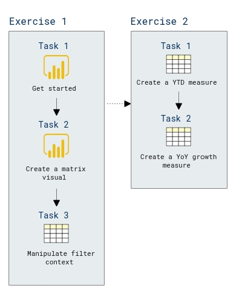

# Lab Scenario Preview: PL-300: Model data with Power BI

## Lab 05: Create DAX Calculations in Power BI Desktop, Part 2

### Lab overview

In this lab you will create measures with DAX expressions involving filter context manipulation. 

## Objective
  
After completing this lab, you will be able to:

- Use the CALCULATE() function to manipulate filter context
- Use Time Intelligence functions

## Architecture Diagram

  
