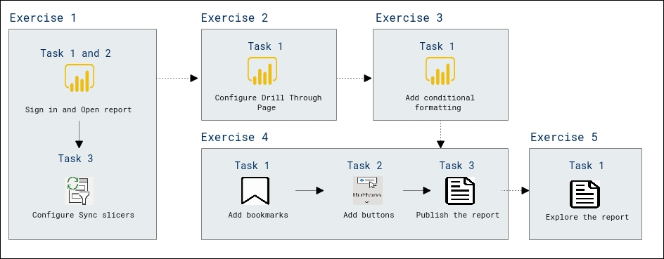

# Lab Scenario Preview: PL-300: Build Power BI visuals and reports

## Lab 07: Design a Report in Power BI Desktop, Part 2

### Lab overview

In this lab you will enhance the Sales Analysis with advanced design features.

## Objective
  
After completing this lab, you will be able to:

- Sync slicers
- Create a drill through page
- Apply conditional formatting
- Create and use bookmarks

## Architecture Diagram

  
