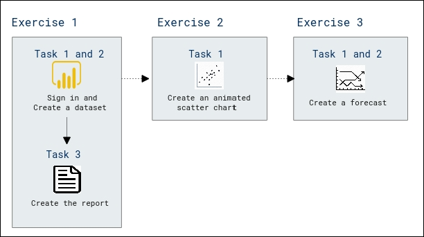

# Lab Scenario Preview: PL-300: Build Power BI visuals and reports

## Lab 08: Perform Data Analysis in Power BI Desktop

### Lab overview

In this lab you will create the Sales Exploration report.

## Objective
  
After completing this lab, you will be able to:

- Create animated scatter charts
- Use a visual to forecast values

## Architecture Diagram

  

Once you understand the lab's content, you can start the Hands-on Lab by clicking the **Launch** button located in the top right corner. This will lead you to the lab environment and guide. You can also preview the full lab guide [here](https://experience.cloudlabs.ai/#/labguidepreview/2bfd2de4-4104-4d4c-afcc-f7f6b258aa09) if you want to go through detailed guide prior to launching lab environment.
